### 3.2 前端方面
#### 3.2.1 使用到的工具和库
##### 3.2.1.1 包管理工具
本项目使用 **npm** 作为包管理工具，它具有以下几个优点：
1. **广泛使用**。npm 是 Node.js 的默认包管理器，拥有庞大的生态系统和丰富的包资源，是前端开发中最常用的包管理工具之一。
2. **稳定可靠**。npm 经过多年发展，功能成熟稳定，提供了完善的包版本管理和依赖解析机制，确保项目依赖的一致性。
3. **支持单体仓库**。npm 支持通过 workspaces 功能管理单个源码仓库中包含的多个软件包，方便大型项目的模块化开发。
4. **生态丰富**。npm 拥有世界上最大的软件包 registry，提供了海量的第三方库和工具，满足各种开发需求。
5. **易于使用**。npm 提供了简洁的命令行接口，支持包的安装、更新、卸载等操作，同时提供了丰富的配置选项，满足不同项目的需求。

##### 3.2.1.2 JS 框架
本项目使用 **Vue 3** 作为 JS 框架，它是一款易学易用、性能出色、适用场景丰富的 Web 前端框架，具有以下几个优点：
1. **易学易用**。基于标准 HTML、CSS 和 JavaScript 构建，提供容易上手的 API 和一流的文档。
2. **性能出色**。经过编译器优化、完全响应式的渲染系统，几乎不需要手动优化。
3. **灵活多变**。丰富的、可渐进式集成的生态系统，可以根据应用规模在库和框架间切换自如。
4. **Composition API**。提供了更灵活的代码组织方式，使逻辑复用更加容易。
5. **TypeScript 支持**。内置对 TypeScript 的支持，提供更好的类型检查和代码提示。

##### 3.2.1.3 前端构建工具
本项目使用 **Vite** 作为前端构建工具，它是一种新型前端构建工具，能够显著提升前端开发体验。它主要由两部分组成：
- 一个开发服务器，它基于 原生 ES 模块 提供了 丰富的内建功能，如速度快到惊人的 模块热更新(HMR)。
- 一套构建指令，它使用 Rollup 打包代码，并且它是预配置的，可输出用于生产环境的高度优化过的静态资源。

##### 3.2.1.4 状态管理库
本项目使用 **Pinia** 作为状态管理库，它有以下几个优点：
1. **所见即所得**。与组件类似的 Store 。其 API 的设计旨在让用户编写出更易组织的 store。
2. **类型安全**。类型可自动推断，即使在 JavaScript 中亦可提供自动补全功能。
3. **开发工具支持**。不管是 Vue 2 还是 Vue 3，支持 Vue devtools 钩子的 Pinia 都能给用户更好的开发体验。
4. **可拓展性**。可通过事务、同步本地存储等方式扩展 Pinia，以响应 store 的变更。
5. **模块化设计**。可构建多个 Store 并允许用户的打包工具自动拆分它们。
6. **极致轻量化**。Pinia 大小只有 1kb 左右，我们甚至可能忘记它的存在。

##### 3.2.1.5 路由管理
本项目使用 **Vue Router** 作为路由管理工具，它是 Vue.js 的官方路由，为多页面应用的构建提供了极大的便利。它具有以下几个优点：
1. **富有表现力的路由语法**。用直观且强大的语法来定义静态或动态路由。
2. **细致的导航控制**。可拦截任何导航并更精确地控制其结果。
3. **基于组件的配置方法**。将每条路由映射到应该显示的组件上。
4. **支持历史模式**。有 HTML5、hash 或记忆历史模式可供选择。
5. **支持滚动控制**。可精确控制每个页面的滚动位置。
6. **支持自动编码**。可直接在代码中使用 unicode 字符。

##### 3.2.1.6 图标库
本项目使用 **Boxicons** 作为图标库，它是一个现代的、全面的开源图标集合，具有以下几个优点：
1. **丰富的图标资源**。提供了大量的图标，涵盖了各种常见的使用场景。
2. **易于使用**。可以通过简单的 HTML 标签或 CSS 类来使用图标。
3. **高度可定制**。可以通过 CSS 来自定义图标的大小、颜色等属性。
4. **响应式设计**。图标可以根据容器的大小自动调整。
5. **轻量级**。体积小，加载速度快，不会影响页面性能。

##### 3.2.1.7 图表绘制库
本项目使用 **Chart.js** 作为图表绘制库，它是一个功能强大、灵活的 JavaScript 图表库，具有以下几个优点：
1. **简单易用**。提供了简洁的 API，使得创建图表变得非常容易。
2. **响应式设计**。图表会自动适应容器的大小变化。
3. **丰富的图表类型**。支持折线图、柱状图、饼图、雷达图等多种图表类型。
4. **高度可定制**。可以通过配置选项来自定义图表的外观和行为。
5. **性能优异**。即使在处理大量数据时也能保持良好的性能。

##### 3.2.1.8 PDF 生成库
本项目使用 **html2pdf.js** 作为 PDF 生成库，它可以将 HTML 内容转换为 PDF 文档，具有以下几个优点：
1. **易于使用**。提供了简单的 API，使得生成 PDF 变得非常容易。
2. **高度可定制**。可以通过配置选项来自定义 PDF 的外观和行为。
3. **支持多种格式**。可以生成多种格式的 PDF 文档。
4. **跨浏览器兼容**。支持主流的浏览器。
5. **无需服务器**。完全在客户端生成 PDF，无需服务器支持。

#### 3.2.2 各模块的实现
##### 3.2.2.1 网络请求模块
XXX

##### 3.2.2.2 数据存储模块
在现代Web应⽤中，数据存储模块是确保数据⼀致性、可⽤性和持久性的关键组件。本项目使用 Pinia 作为状态管理库，结合 localStorage 实现数据的持久化存储。以下是用户存储模块的核心实现：

```javascript
import { defineStore } from 'pinia'
import { ref } from 'vue'

export const useUserStore = defineStore('user', () => {
  const isLoggedIn = ref(false)
  const username = ref('未命名')
  const phone = ref('')
  const avatar = ref('') 

  // 登录时初始化
  function login(loginPhone) {
    isLoggedIn.value = true
    phone.value = loginPhone
    username.value = '未命名'
    avatar.value = '' // 默认无头像，交由CSS渲染机甲默认图
    saveUserInfo()
  }

  function loadUserInfo() {
    const storedUserInfo = localStorage.getItem('spansUserInfo')
    if (storedUserInfo) {
      const userInfo = JSON.parse(storedUserInfo)
      username.value = userInfo.username || '未命名'
      phone.value = userInfo.phone || ''
      avatar.value = userInfo.avatar || ''
      isLoggedIn.value = true
    }
  }

  function updateUserInfo(userData) {
    if (userData.username !== undefined) username.value = userData.username
    if (userData.phone !== undefined) phone.value = userData.phone
    if (userData.avatar !== undefined) avatar.value = userData.avatar
    saveUserInfo()
  }

  function saveUserInfo() {
    const userInfo = {
      username: username.value,
      phone: phone.value,
      avatar: avatar.value
    }
    localStorage.setItem('spansUserInfo', JSON.stringify(userInfo))
  }

  return { isLoggedIn, username, phone, avatar, login, loadUserInfo, updateUserInfo }
})
```

该模块通过 localStorage 手动实现数据持久化，确保用户信息在刷新页面后仍然保持。

#### 3.2.3 各页面的实现
##### 3.2.3.1 系统展示页面
系统在进入前设计了展示页面，用于呈现系统基本信息与视觉美术风格，核心功能包含进入系统入口与项目简介展示。
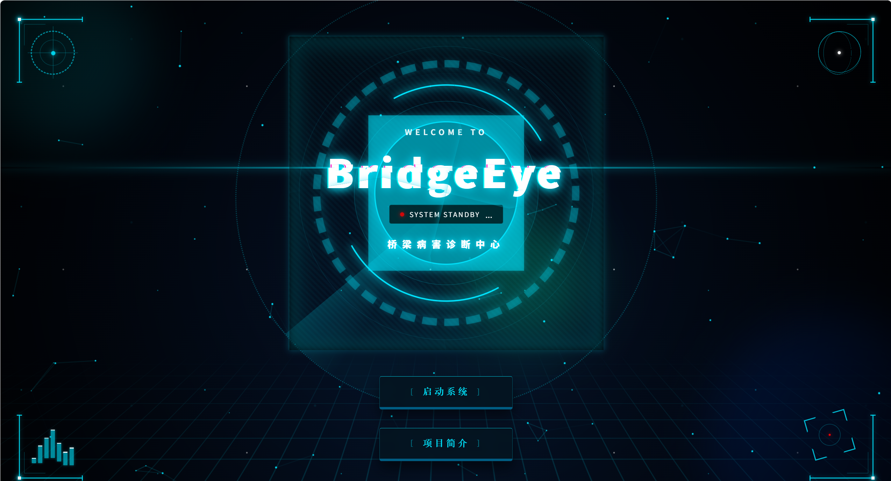
本页面采用科幻风格，含有丰富的动画效果以及装饰元素，以增强用户体验。下面是部分功能的实现：
HUD视觉元素：
```html
<!-- HUD 视觉效果 -->
<div class="hud-overlay">
  <!-- 左上角光学传感器 -->
  <div class="hud-visual visual-tl">
    <div class="optical-sensor">
      <div class="optical-ring outer-dashed"></div>
      <div class="optical-ring inner-solid"></div>
      <div class="optical-cross"></div>
      <div class="optical-core"></div>
    </div>
  </div>

  <!-- 右上角陀螺仪 -->
  <div class="hud-visual visual-tr">
    <div class="gyro-stabilizer">
      <div class="gyro-axis axis-x"></div>
      <div class="gyro-axis axis-y"></div>
      <div class="gyro-axis axis-z"></div>
      <div class="gyro-center"></div>
    </div>
  </div>

  <!-- 左下角共振波形 -->
  <div class="hud-visual visual-bl">
    <div class="resonance-wave">
      <div class="wave-bar bar-1"></div>
      <div class="wave-bar bar-2"></div>
      <div class="wave-bar bar-3"></div>
      <div class="wave-bar bar-4"></div>
      <div class="wave-bar bar-5"></div>
      <div class="wave-bar bar-6"></div>
      <div class="wave-bar bar-7"></div>
    </div>
  </div>

  <!-- 右下角瞄准星 -->
  <div class="hud-visual visual-br">
    <div class="targeting-reticle">
      <div class="reticle-bracket br-tl"></div>
      <div class="reticle-bracket br-tr"></div>
      <div class="reticle-bracket br-bl"></div>
      <div class="reticle-bracket br-br"></div>
      <div class="reticle-ring"></div>
      <div class="reticle-dot"></div>
    </div>
  </div>
</div>
```
盾牌组件：
```html
<!-- 核心机甲装甲金属总成 -->
<div class="shield-assembly">
  <div class="shield-core-glow"></div>

  <!-- 四个象限面板 -->
  <div
    v-for="q in ['tl', 'tr', 'bl', 'br']"
    :key="q"
    class="quadrant-wrapper"
    :class="'w-' + q"
  >
    <div
      class="quadrant-panel"
      :class="'q-' + q"
    >
      <div class="armor-plate"></div>

      <div class="mechanical-shield-ui">
        <div class="shield-ring target-ring"></div>
        <div class="shield-ring gear-ring-outer"></div>
        <div class="shield-ring dashed-ring-ccw"></div>
        <div class="shield-ring scale-ring"></div>
        
        <div class="shield-ring core-ring">
          <div class="energy-pulse"></div>
        </div>

        <!-- 中心文字内容 -->
        <div class="center-content">
          <h2 class="sub-title">WELCOME TO</h2>
          <h1 class="glitch-text" data-text="BridgeEye">BridgeEye</h1>
          <div class="scanning-status-wrapper">
            <span class="status-icon"></span>
            <span class="status-text">SYSTEM STANDBY</span>
            <span class="scanning-dots">...</span>
          </div>
          <h3 class="sys-name">桥梁病害诊断中心</h3>
        </div>
      </div>
    </div>
  </div>
</div>
```
核心动画效果：
```css
/* 陀螺仪 X 轴 3D 旋转 */
@keyframes gyroX {
  0% {
    transform: rotateX(0deg);
  }
  100% {
    transform: rotateX(360deg);
  }
}

/* 陀螺仪 Y 轴 3D 旋转 */
@keyframes gyroY {
  0% {
    transform: rotateY(0deg);
  }
  100% {
    transform: rotateY(360deg);
  }
}

/* 陀螺仪 Z 轴 3D 旋转 */
@keyframes gyroZ {
  0% {
    transform: rotateZ(0deg);
  }
  100% {
    transform: rotateZ(360deg);
  }
}

/* 能量波形高度起伏缩放动画 */
@keyframes waveAnim {
  0% {
    transform: scaleY(0.5);
  }
  100% {
    transform: scaleY(1);
  }
}

/* 左上碎片防爆门退场核心动画 */
@keyframes blastTL {
  0% {
    transform: translate(0, 0);
  }
  20% {
    transform: translate(-15px, -15px);
    filter: brightness(1.5);
  }
  100% {
    transform: translate(-150vw, -150vh) rotate(-25deg) scale(0.4);
    opacity: 0;
  }
}

/* 右上碎片爆射退场 */
@keyframes blastTR {
  0% {
    transform: translate(0, 0);
  }
  20% {
    transform: translate(15px, -15px);
    filter: brightness(1.5);
  }
  100% {
    transform: translate(150vw, -150vh) rotate(25deg) scale(0.4);
    opacity: 0;
  }
}

/* 左下碎片爆射退场 */
@keyframes blastBL {
  0% {
    transform: translate(0, 0);
  }
  20% {
    transform: translate(-15px, 15px);
    filter: brightness(1.5);
  }
  100% {
    transform: translate(-150vw, 150vh) rotate(-25deg) scale(0.4);
    opacity: 0;
  }
}

/* 右下碎片爆射退场 */
@keyframes blastBR {
  0% {
    transform: translate(0, 0);
  }
  20% {
    transform: translate(15px, 15px);
    filter: brightness(1.5);
  }
  100% {
    transform: translate(150vw, 150vh) rotate(25deg) scale(0.4);
    opacity: 0;
  }
}

/* 核心底座光源引爆扩散动画 */
@keyframes coreExplode {
  0% {
    transform: translate(-50%, -50%) scale(1);
    opacity: 1;
  }
  100% {
    transform: translate(-50%, -50%) scale(15);
    opacity: 0;
  }
}

/* 按钮专属的极速滑落退场动画 */
@keyframes btnExit {
  0% {
    opacity: 1;
    transform: translate(0%, 0) scale(1);
  }
  100% {
    opacity: 0;
    transform: translate(0%, 30px) scale(0.8);
  }
}

/* 核心防爆盾首次初始化入场 Z 轴拉伸拉近动画 */
@keyframes shieldDeploy {
  0% {
    transform: scale(0.5) translateZ(-500px);
    opacity: 0;
    filter: blur(15px);
  }
  100% {
    transform: scale(1) translateZ(0);
    opacity: 1;
    filter: blur(0px);
  }
}

/* 四周 HUD 仪表盘坍缩退场动画 */
@keyframes hudCollapse {
  to {
    transform: scale(0.5) translateZ(-200px);
    opacity: 0;
    filter: blur(8px);
  }
}

/* 通用由下至上透明度淡入动画 */
@keyframes fadeUp {
  from {
    opacity: 0;
    transform: translateY(20px);
  }
  to {
    opacity: 1;
    transform: translateY(0);
  }
}

/* 二维顺时针 360 度循环平滑旋转 */
@keyframes spinCW {
  to {
    transform: translate(-50%, -50%) rotate(360deg);
  }
}

/* 二维逆时针 360 度循环平滑旋转 */
@keyframes spinCCW {
  to {
    transform: translate(-50%, -50%) rotate(-360deg);
  }
}

/* 缩放脉冲放大呼吸动画 */
@keyframes pulse {
  to {
    transform: translate(0%, 0%) scale(1.1);
    opacity: 0.5;
  }
}

/* 红色警告点发光闪动动画 */
@keyframes statusPulse {
  to {
    opacity: 0.3;
    box-shadow: 0 0 3px #f00;
  }
}

/* 文本交替频闪动画 */
@keyframes textBlink {
  0%, 100% {
    opacity: 1;
  }
  50% {
    opacity: 0.2;
  }
}

/* 按钮表面强光滑过动画 */
@keyframes btnScan {
  0% {
    left: -100%;
  }
  50%, 100% {
    left: 200%;
  }
}

/* 扫描状态省略号等距点阵显示动画 */
@keyframes dotsBlink {
  0%, 20% {
    content: '';
  }
  40% {
    content: '.';
  }
  60% {
    content: '..';
  }
  80%, 100% {
    content: '...';
  }
}

/* 故障文字前置伪元素动态随机横向剪切区动画 */
@keyframes glitch-anim-1 {
  0% {
    clip-path: inset(20% 0 80% 0);
  }
  20% {
    clip-path: inset(60% 0 10% 0);
  }
  40% {
    clip-path: inset(40% 0 50% 0);
  }
  60% {
    clip-path: inset(80% 0 5% 0);
  }
  80% {
    clip-path: inset(10% 0 70% 0);
  }
  100% {
    clip-path: inset(30% 0 20% 0);
  }
}

/* 故障文字后置伪元素反向动态剪切区动画 */
@keyframes glitch-anim-2 {
  0% {
    clip-path: inset(10% 0 60% 0);
  }
  20% {
    clip-path: inset(30% 0 20% 0);
  }
  40% {
    clip-path: inset(70% 0 10% 0);
  }
  60% {
    clip-path: inset(20% 0 50% 0);
  }
  80% {
    clip-path: inset(50% 0 30% 0);
  }
  100% {
    clip-path: inset(5% 0 80% 0);
  }
}

/* 项目简介页面发光动画 */
@keyframes shine {
  100% {
    left: 100%;
  }
}
```
在点击展示页面的项目简介按钮后，会跳转到项目简介页面，展示项目的详细信息。
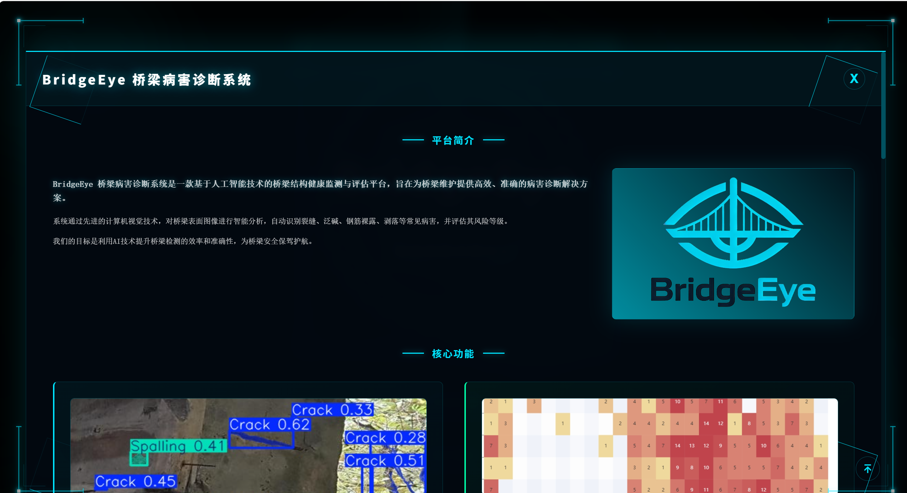
页面里介绍了系统的核心功能、操作流程、应用场景等信息，并同样有丰富的交互效果。
在点击启动系统按钮后，会跳转到登录页面，用户需要输入邮箱和密码进行身份验证。
##### 3.2.3.2 登录页面
登录页面采用了终端风格的设计，提供了账号密码登录、验证码登录、注册和密码重置等功能，满足不同用户的需求。
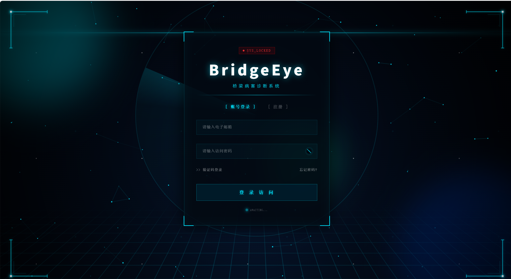
在填写邮箱和密码时，我们使⽤正则表达式检测格式是否正确，并且对输入进行了过滤。
```JavaScript
  const isValidEmail = computed(() => {
  const emailRegex = /^[a-zA-Z0-9._%+-]+@[a-zA-Z0-9.-]+\.[a-zA-Z]{2,}$/;
  return emailRegex.test(formData.email);
});

// 邮箱输入过滤（只允许字母、数字、@、.、_、%、+、-）
@input="formData.email = formData.email.replace(/[^a-zA-Z0-9@._%+-]/g, ''); clearError()"

// 密码输入过滤（只允许ASCII可打印字符）
@input="formData.password = formData.password.replace(/[^\x21-\x7E]/g, ''); clearError()"
```
点击登录按钮后，对表单进行提交处理。
```JavaScript
const handleSubmit = () => {
  // 复用计算属性，消除重复验证逻辑
  const isEmailValid = isValidEmail.value; 
  const isPwdComplete = ['pwd', 'register', 'reset'].includes(authMode.value) ? formData.password.length > 0 : true;
  const isCodeComplete = ['code', 'register', 'reset'].includes(authMode.value) ? formData.verifyCode.length === 6 : true;

  if (!isEmailValid || !isPwdComplete || !isCodeComplete) {
    if (errorTimer) clearTimeout(errorTimer);
    authStatus.value = 'error'; 
    errorTimer = setTimeout(() => {
      authStatus.value = 'idle'; 
    }, 1000);
    return; 
  }

  authStatus.value = 'loading';
  
  loadingTimer = setTimeout(() => {
    
    if (formData.password === 'error') {
      authStatus.value = 'error';
      return; 
    }

    authStatus.value = 'success'; 
    
    if (['pwd', 'code'].includes(authMode.value)) {
      userStore.login(formData.email);
      actionTimer = setTimeout(() => {
        router.push('/dashboard');
      }, 1000);
    } else {
      actionTimer = setTimeout(() => {
        alert("操作指令已确立执行。");
        switchMode('pwd');
      }, 1000);
    }

  }, 1500);
};
```
同时系统根据登录的情况会展示不同的动画效果。（登录成功、登录失败）
登录成功
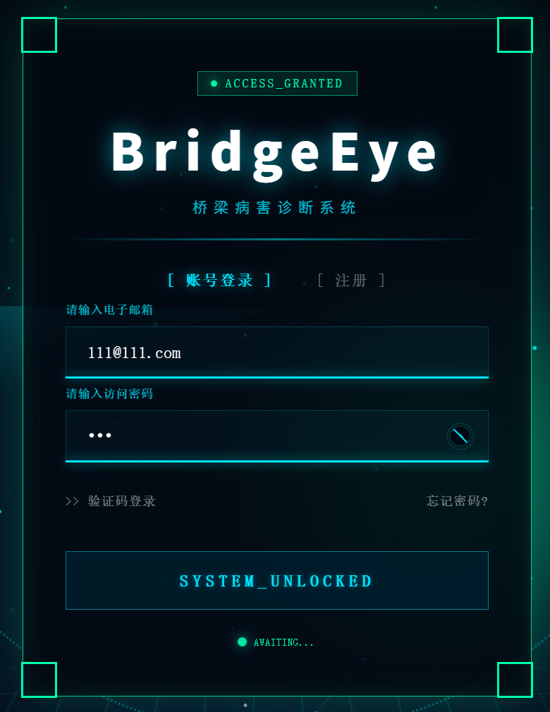
登录失败
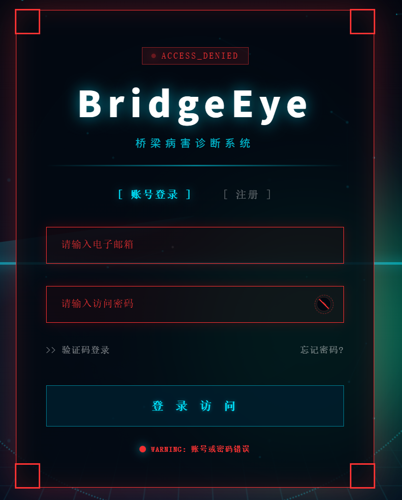


##### 3.2.3.2 主界面
主界面是系统的核心页面，包含导航菜单和统计数据展示板。
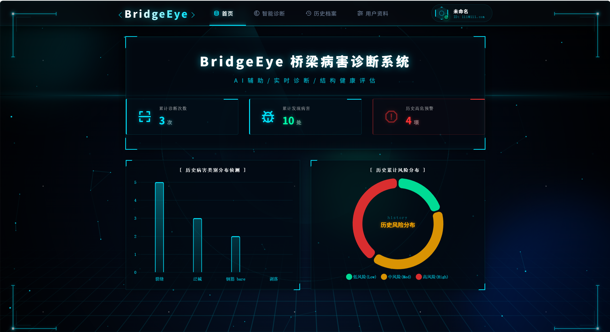


```vue
<template>
  <div class="main-container">
    <header class="hardcore-navbar">
      <div class="nav-left">
        <div class="logo">
          <span class="bracket">&lt;</span>
          <span class="sys-name">BridgeEye</span>
          <span class="sys-version"></span>
          <span class="bracket">/&gt;</span>
        </div>
      </div>
      
      <nav class="nav-center">
        <div 
          v-for="item in menu" 
          :key="item.path"
          :class="['nav-item', { 'active': $route.path === item.path }]"
          @click="navigateTo(item.path)"
        >
          <div class="nav-item-inner">
            <i class='bx' :class="item.icon"></i>
            <span>{{ item.name }}</span>
          </div>
          <div class="status-line"></div>
          <div class="hover-glow"></div>
        </div>
      </nav>

     <div class="nav-right">
        <div class="user-profile" @click="navigateTo('/profile')">
          <div class="tech-avatar-wrapper">
            
            <div v-else class="tech-avatar"></div>
            <div class="online-dot"></div>
          </div>
          <div class="user-info">
            <span class="username">{{ userStore.username }}</span>
            <span class="user-role">ID: {{ userStore.phone || 'GUEST' }}</span>
          </div>
        </div>
      </div>
    </header>
    
    <main class="main-content">
      <router-view v-slot="{ Component }">
        <transition name="glitch-slide" mode="out-in">
          <component :is="Component" />
        </transition>
      </router-view>
    </main>
  </div>
</template>

<script setup>
import { useRoute, useRouter } from 'vue-router'
import { useUserStore } from '@/stores/user'

const route = useRoute()
const router = useRouter()
const userStore = useUserStore()

// 导航菜单配置项数组
const menu = [
  { path: '/dashboard', name: '首页', icon: 'bx-data' },
  { path: '/diagnose', name: '智能诊断', icon: 'bx-radar' },
  { path: '/history', name: '历史档案', icon: 'bx-history' },
  { path: '/profile', name: '用户资料', icon: 'bx-slider-alt' }
]

// 导航跳转方法
const navigateTo = (path) => {
  router.push(path)
}
</script>
```

主界面采用了科幻风格的导航栏，提供了清晰的功能入口，方便用户快速访问系统的各个模块。同时有展示板展示当前统计数据

##### 3.2.3.3 检测页面
检测页面是系统的核心功能页面，用于上传桥梁图像并进行病害检测。
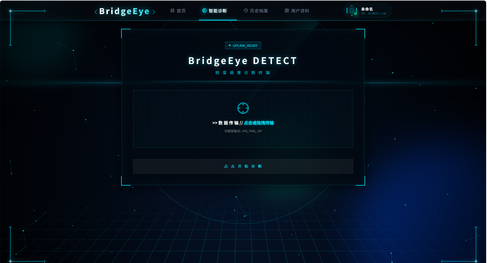
文件上传模块支持批量上传，用户可以一次上传多张图像或zip文件进行检测。
```javascript
// 基本状态管理
const fileInput = ref(null);
const isDragging = ref(false);       
const status = ref('idle');          
const uploadedFiles = ref([]);       
//文件上传触发
const triggerFileInput = () => { 
  if (status.value === 'idle') fileInput.value.click(); 
};
//拖拽处理
const handleDrop = (e) => { 
  isDragging.value = false; 
  if (status.value !== 'idle') return; 
  if (e.dataTransfer.files.length > 0) processFiles(e.dataTransfer.files); 
};
//文件选择处理
const handleFileSelect = (e) => { 
  if (e.target.files.length > 0) processFiles(e.target.files); 
  e.target.value = ''; 
};
//文件处理
const processFiles = (files) => {
  const maxSize = 50 * 1024 * 1024;
  Array.from(files).forEach(file => {
    if (file.size > maxSize) return alert(`SYSTEM_WARN: 文件 ${file.name} 超过 50MB。`);
    if (!uploadedFiles.value.some(f => f.name === file.name)) uploadedFiles.value.push(file);
  });
};
//文件大小格式化
const formatSize = (bytes) => {
  if (bytes === 0) return '0 B';
  const k = 1024, sizes = ['B', 'KB', 'MB', 'GB'], i = Math.floor(Math.log(bytes) / Math.log(k));
  return parseFloat((bytes / Math.pow(k, i)).toFixed(2)) + ' ' + sizes[i];
};
//文件分析开始
const startAnalysis = () => {
  if (uploadedFiles.value.length === 0 || status.value !== 'idle') return;
  status.value = 'analyzing';
  
  analyzeTimer = setTimeout(() => {
    if (isLeaving.value) return;
    status.value = 'success';
    successTimer = setTimeout(() => { openReportModal(); }, 1200);
  }, 3000);
};

```
检测完成后，系统会生成检测报告，包含检测结果、病害类型、风险等级等信息，并以单独页面展示。
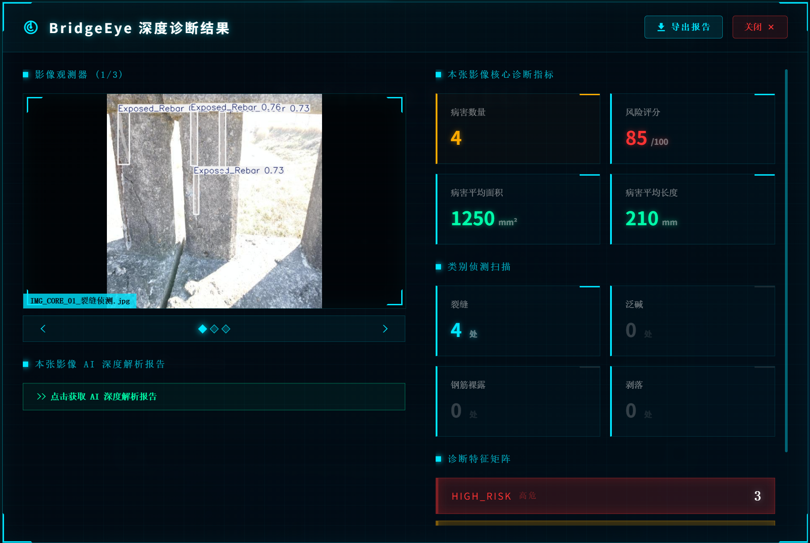
该页面包含影像观测、AI报告、导出报告等功能。用户可以根据需要查看和分析检测结果，同时也可以导出报告进行进一步的分析和分享。以下是核心实现：
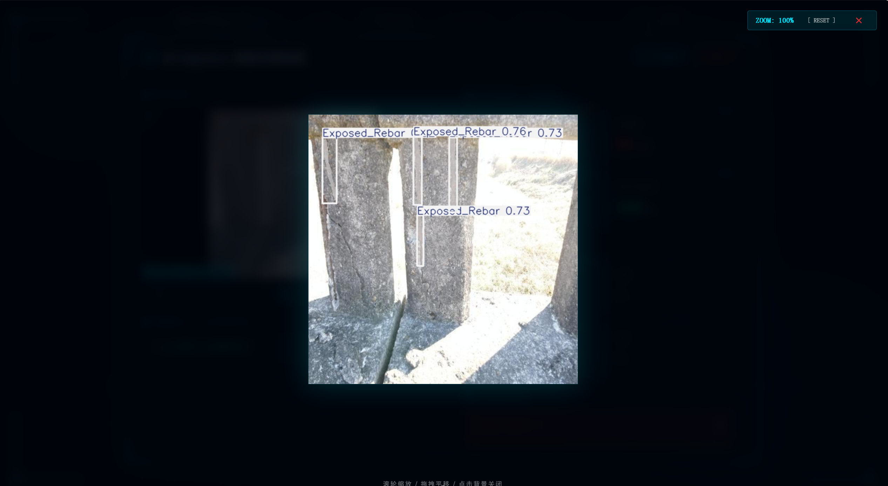
```javascript
// 图片轮播控制
const currentImageIndex = ref(0);

const nextImage = () => { 
  if (currentImageIndex.value < resultImages.value.length - 1) currentImageIndex.value++; 
  else currentImageIndex.value = 0; 
};

const prevImage = () => { 
  if (currentImageIndex.value > 0) currentImageIndex.value--; 
  else currentImageIndex.value = resultImages.value.length - 1; 
};

const setCurrentImage = (idx) => { 
  currentImageIndex.value = idx; 
};

// 图片缩放功能
const showZoomModal = ref(false);
const zoomedImageUrl = ref('');

// 变换状态
const zoomScale = ref(1);
const panX = ref(0);
const panY = ref(0);

// 拖拽控制变量
const isPanning = ref(false);
let startMouseX = 0;
let startMouseY = 0;
let initialPanX = 0;
let initialPanY = 0;

const openZoomModal = (url) => {
    zoomedImageUrl.value = url;
    showZoomModal.value = true;
    resetZoom();
};

const closeZoomModal = () => {
    showZoomModal.value = false;
    zoomedImageUrl.value = '';
    stopPan();
};

const resetZoom = () => {
    zoomScale.value = 1;
    panX.value = 0;
    panY.value = 0;
};

// 滚轮缩放事件
const handleZoomWheel = (e) => {
    // 缩放灵敏度
    const zoomSensitivity = 0.0015;
    const delta = -e.deltaY * zoomSensitivity;
    let newScale = zoomScale.value + delta;
    
    // 限制缩放比例范围 10% - 800%
    newScale = Math.max(0.1, Math.min(newScale, 8));
    zoomScale.value = newScale;
};

// 开始拖拽
const startPan = (e) => {
    isPanning.value = true;
    startMouseX = e.clientX;
    startMouseY = e.clientY;
    initialPanX = panX.value;
    initialPanY = panY.value;
    window.addEventListener('mousemove', onPan);
    window.addEventListener('mouseup', stopPan);
};

// 拖拽中
const onPan = (e) => {
    if (!isPanning.value) return;
    panX.value = initialPanX + (e.clientX - startMouseX);
    panY.value = initialPanY + (e.clientY - startMouseY);
};

// 停止拖拽
const stopPan = () => {
    isPanning.value = false;
    window.removeEventListener('mousemove', onPan);
    window.removeEventListener('mouseup', stopPan);
};

```
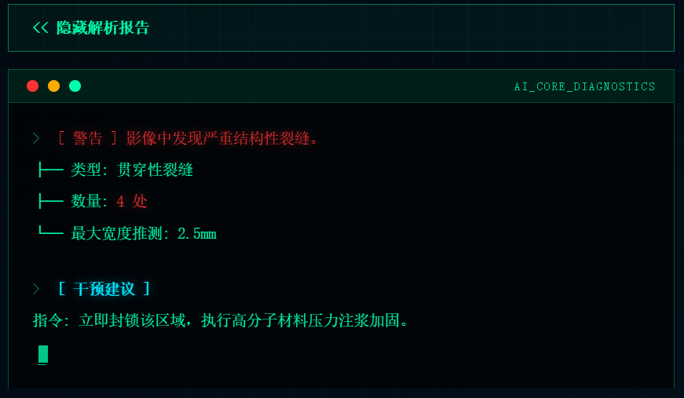
```javascript
// AI 报告状态
const showAiSummary = ref(false);

// 切换 AI 报告显示
const toggleAiSummary = () => {
  showAiSummary.value = !showAiSummary.value;
};

// 当前图片数据计算
const currentImageData = computed(() => resultImages.value[currentImageIndex.value] || null);

```
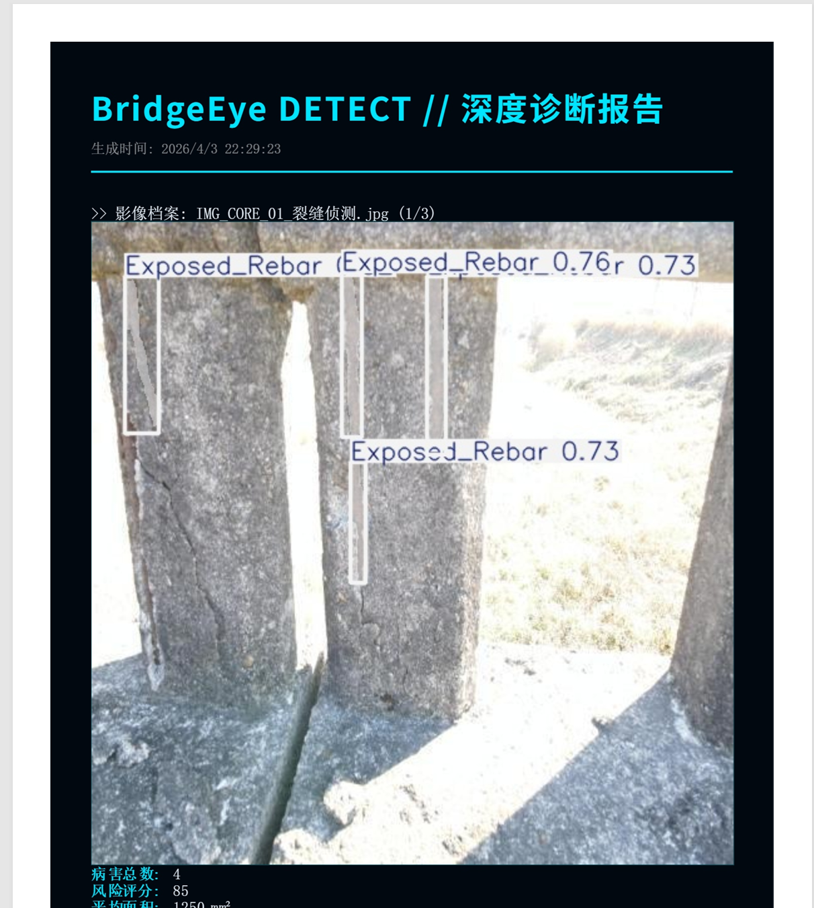
```javascript
// 导出状态
const isExporting = ref(false);

// PDF 导出
const downloadPDF = async () => {
  if (isExporting.value) return;
  isExporting.value = true;
  
  setTimeout(() => {
    const element = document.getElementById('pdf-pure-template');
    const opt = {
      margin:       10,
      filename:     `BridgeEye_Diagnostic_Report_${new Date().getTime()}.pdf`,
      image:        { type: 'jpeg', quality: 0.98 },
      html2canvas:  { scale: 2, useCORS: true, backgroundColor: '#020810', windowWidth: 800 },
      jsPDF: { unit: 'mm', format: 'a4', orientation: 'portrait' },
      pagebreak: { mode: ['avoid-all', 'css', 'legacy'] }
    };

    html2pdf().set(opt).from(element).save().then(() => {
      isExporting.value = false;
    }).catch(err => {
      console.error('PDF Generation Error:', err);
      isExporting.value = false;
    });

  }, 800); 
};

```

##### 3.2.3.4 历史记录页面
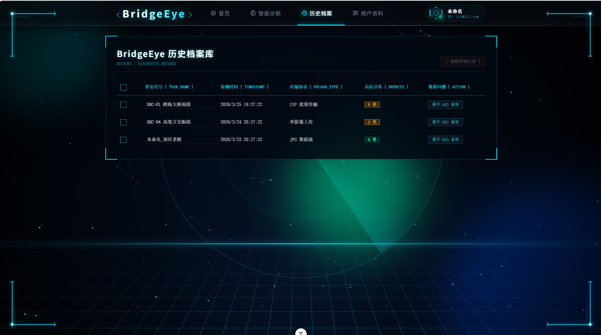
历史记录页面用于查看和管理历史检测记录。每条记录展开后与检测报告页面相同，这里不再赘述。以下是历史记录管理的核心功能实现：
```javascript
import { ref, computed, onMounted, watch, onBeforeUnmount } from 'vue'
import html2pdf from 'html2pdf.js'
import { useHistoryStore } from '@/stores/history'

// 状态管理
const historyStore = useHistoryStore()
const selectedIds = ref([])
const selectAll = ref(false)

// HUD Report (查看报告详情)相关状态
const showReportModal = ref(false)
const selectedRecord = ref(null)
const showAiSummary = ref(false)
const currentImageIndex = ref(0)
const resultImages = ref([])
const isExporting = ref(false)

// 动态获取当前活动图片的数据（支持独立展示）
const currentImageData = computed(() => {
  return resultImages.value[currentImageIndex.value] || null;
});

// 样式动态计算
const riskScoreClass = computed(() => {
    const score = currentImageData.value?.reportData?.risk_score || 0;
    if (score >= 80) return 'text-red';
    if (score >= 60) return 'text-orange';
    return 'text-green';
});

// 数据转换 Helper
const getClassName = (c) => ({ crack: '裂缝', efflorescence: '泛碱', 'exposed rebar': '钢筋裸露', spalling: '剥落' }[c] || c)

// 初始化时从本地加载记录
onMounted(() => {
  historyStore.loadHistoryRecords()
})

// 清理事件监听
onBeforeUnmount(() => {
  window.removeEventListener('mousemove', onPan)
  window.removeEventListener('mouseup', stopPan)
})

```
##### 3.2.3.5 用户资料页面
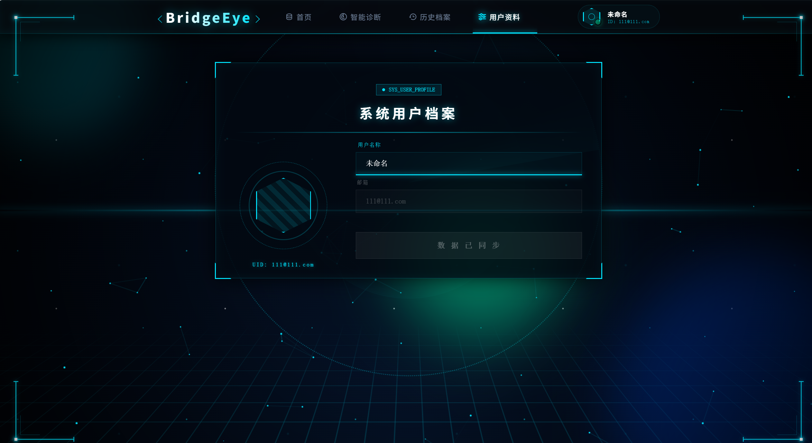
用户资料页面用于查看和管理用户信息。以下是核心实现：
```javascript
<script setup>
import { ref, onMounted, computed, watch } from 'vue'
import { useUserStore } from '@/stores/user'

// 引入全局用户状态仓库
const userStore = useUserStore()
const fileInput = ref(null)
const avatarUrl = ref('')

// 本地表单状态，用于和原始数据做对比
const userForm = ref({ username: '', phone: '' })
const originalUserInfo = ref({})

// 页面加载时初始化数据
onMounted(() => {
  userStore.loadUserInfo()
  avatarUrl.value = userStore.avatar
  userForm.value = {
    username: userStore.username,
    phone: userStore.phone
  }
  // 保存一份原始数据的拷贝，用于判断是否有修改
  originalUserInfo.value = { ...userForm.value }
})

// 监听跨组件的头像数据变化
watch(() => userStore.avatar, (newAvatar) => { 
  avatarUrl.value = newAvatar 
})

// 触发隐藏的 input 框点击事件
const triggerAvatarUpload = () => { 
  fileInput.value.click() 
}

// 处理头像上传：将图片转为 Base64 格式保存在本地
const handleAvatarUpload = (event) => {
  const file = event.target.files[0]
  if (file) {
    const reader = new FileReader()
    reader.onload = (e) => {
      const base64 = e.target.result
      avatarUrl.value = base64
      userStore.updateUserInfo({ avatar: base64 }) // 立即更新到 Store 同步全局
    }
    reader.readAsDataURL(file)
  }
}

// 动态计算属性：验证表单数据是否发生变化，以控制按钮的禁用状态
const hasChanges = computed(() => {
  return JSON.stringify(userForm.value) !== JSON.stringify(originalUserInfo.value)
})

// 保存修改的用户信息
const saveUserInfo = () => {
  if (hasChanges.value) {
    userStore.updateUserInfo(userForm.value)
    // 更新完成后重新对齐原始数据基准
    originalUserInfo.value = { ...userForm.value }
  }
}
</script>
```


        